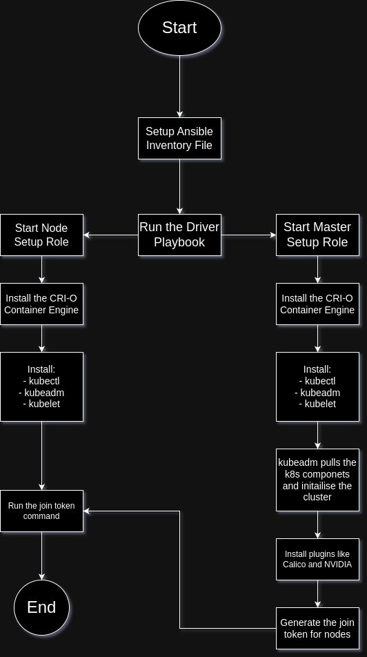

# Infrastucture Management and Deplyment over Kubernetes Cluster using Ansible and Helm Chart 

## Create Kubernetes Cluster
#### Setting up ansible for setup of Kubernetes infrastructure 

```sh
pip3 install ansible
yum install sshpass
```

#### Clone the repo
```sh
git clone https://github.com/vardhan249/K8_test.git
```

#### Files Description in ansible

| File | Description |
| ------ | ------ |
| ansible.cfg | Ansible Configuration File |
| hosts | Ansible Inventory file  |
| roles | Roles Directory consisting role for setting up K8s master and woker nodes |
| setup_k8s.yml | Driver Playbook to run the roles |

#### Steps to run Ansible to setup infrastructure
- Enter the master and worker node IP under the respective hosts group in ansible 
- Run the playbook using the followinf command
    ```sh
    ansible-playbook setup_k8s.yml
    ```
    
#### Infrastructure Information Created using ansible
> The following ansible playbook creates a master worker node setup.
> Master works as kubernetes client in this senario.
> The cluster uses CRI-O as Container Engine.
> Calico is setup as CNI Plugin for overlay network.
> Installs Nvidia Kubernetes Device plugin to allow Kubernetes to schedule pods with GPU resources.

> NOTE: `nvidia driver` needs to be preinstalled on the worker nodes

#### Flowchart of Playbook


## Deploying Application using Helm
#### Install helm on the client

```sh
curl -fsSL -o get_helm.sh https://raw.githubusercontent.com/helm/helm/main/scripts/get-helm-3
chmod 700 get_helm.sh
./get_helm.sh
```

#### Directory Structure of Helm Chart

> Helm Chart create: `webapp`

| File | Description |
| ------ | ------ |
| charts/ |  for dependencies |
| templates/ | YAML templates for Kubernetes resources  |
| values.yaml | configuration values |
| Chart.yaml | metadata for the chart |

#### Running the helm chart
- Copy helm chart to client

- Install the helm chart
    ```bash
    helm install v1 webapp
    ```
    > This installs Helm chart called webapp with the release name v1
    
- Handling upgrades and rollback
     - Upgrade 
         - Change the container image from `vardhan911/webapp:v1` to `vardhan911/webapp:v2` in `values.yaml`
         - Deploy the changes done
           ```bash
           helm upgrade v1 webapp
           ```
    - Rollback
        - Start Rollback
            ```sh
            helm rollback v1
            ```

# Deployment Strategy for Deploying containers over GPU
> We can use MIG feature to utilize the GPU resouce for efficient distribution, which creates partition of a single physical GPU into multiple isolated instances, which allows multiple containers to share the same GPU and provides multiple independent GPU instances, each acting as a separate virtual GPU. Each instance can be allocated to a container for workload isolation and efficient resource utilization. 

### Example Workflow Summary with MIG:
   - Enable MIG Mode: Partition a single GPU into multiple independent instances using MIG.
   - Configure NVIDIA Device Plugin: Set up Kubernetes to recognize MIG instances as separate devices.
   - Deploy Containers with MIG: Create a Kubernetes deployment where each container requests a MIG instance.
   - Scale Deployments: Scale the number of containers while efficiently utilizing GPU resources through MIG.
   - Monitor and Optimize: Track GPU usage at the MIG instance level and adjust the partitioning and scaling accordingly.
   - This approach ensures that you fully utilize your GPU resources by leveraging MIG, especially for tasks like creating embeddings that may not require the full power of a large GPU but still benefit from GPU acceleration.
    


